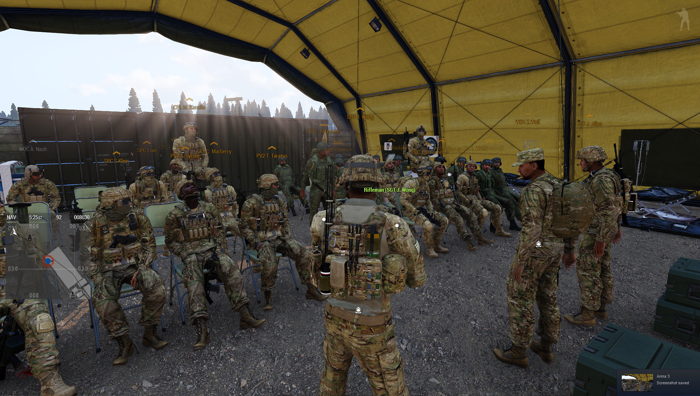
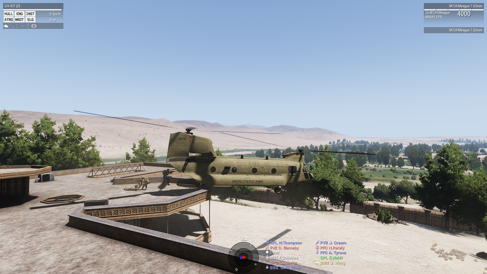
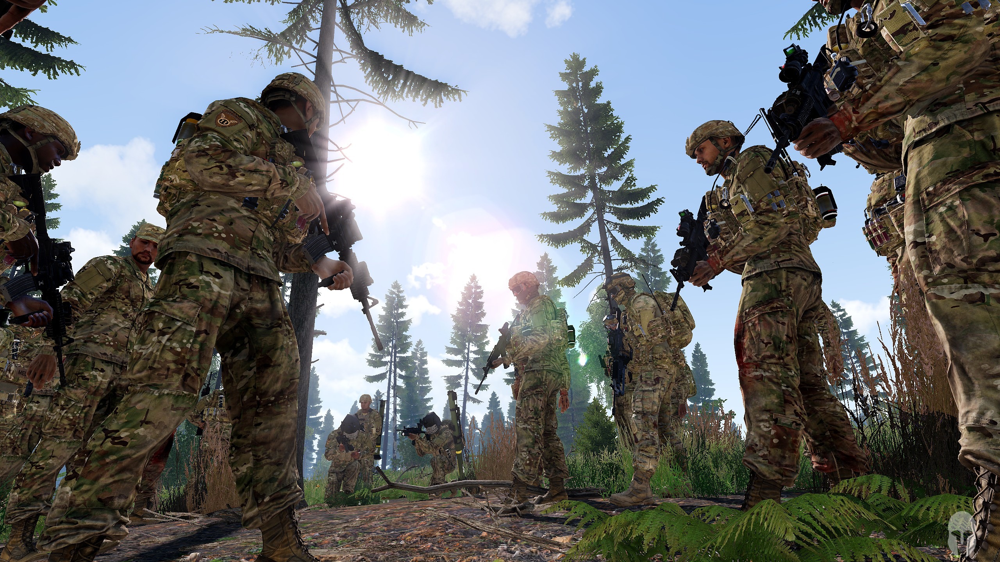
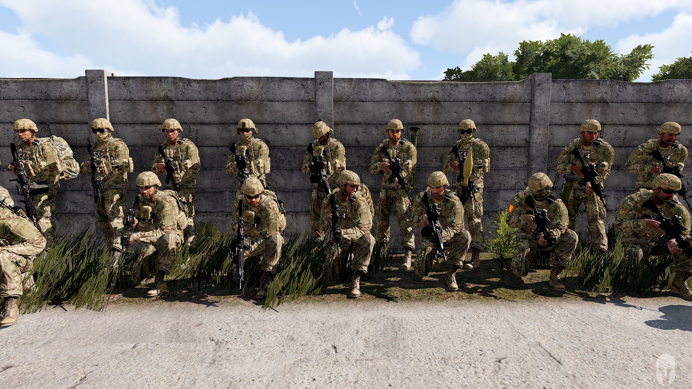

About
=====

The 11thAD hosts a main operation per week. Additionally, we host several PVP and cooperative events involving the Russian unit AIR. We regularly train basic infantry skills like reacting to ambushes, combat in urban environments, etc. But our main focus is on airborne tactics.

   Platoon lead debriefs members of the 11thAD after an operation.

   Aviation evacuates a squad from the roof of a mansion in a Chinook.

   A squad contemplates a training task before stepping off.

   Unit members pose for a group photo after clearing an airfield.