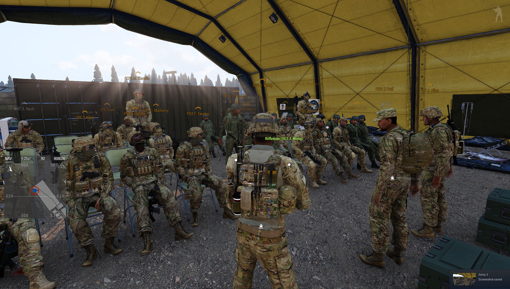
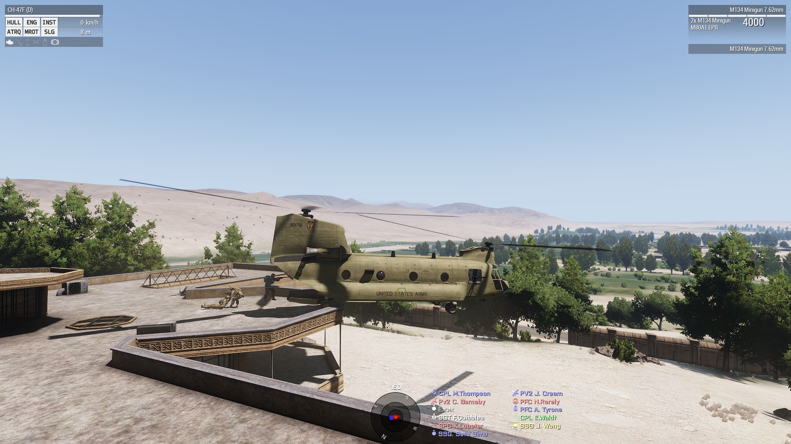

About
=====

The 11thAD hosts a main operation per week. Additionally, we host several PVP and cooperative events involving the Russian unit AIR.

We regularly train basic infantry skills like reacting to ambushes, combat in urban environments, etc. But our main focus is on airborne tactics.

