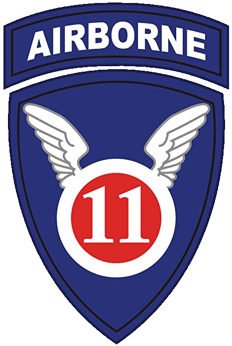

.. 11th Airborne Division documentation master file, created by
   sphinx-quickstart on Tue Jul 21 22:02:25 2020.
   You can adapt this file completely to your liking, but it should at least
   contain the root `toctree` directive.

11th Airborne Division
======================

.. toctree::
  :hidden:

  about
  join
  setup
  streaming

**Who we are:**

The 11th Airborne Division (11thAD) is an Arma3 milsim community. We are a group of kind and skilled Arma3 players.  We want you to play with us to create a combat experience that is realistic and fun. We look for Arma3 players of any skill and experience.

**What we offer:**

With years of knowledge from Arma players and real-life soldiers, the 11thAD creates a milsim feel no one else can provide. We strive to have the best leaders because strong leading makes or breaks a unit. If you are new to Arma 3, both your officers and teammates help you grow.

**How we roll:**

Our mission design team takes great care in hosting our ops. We have special members who set up and run our weekly missions. They create varying, tough, and fun action for you to enjoy. In-game our design team makes the AI apply skilled flanking and combined arms tactics to push you to your limit.

Every week players from all parts of the world share a meaningful, heavy-action hike in the 11thAD.

Join us.

- I want to join. `How do I join? <join.html>`_
- I have joined. `What next? <setup.html>`_