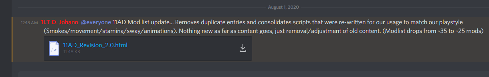
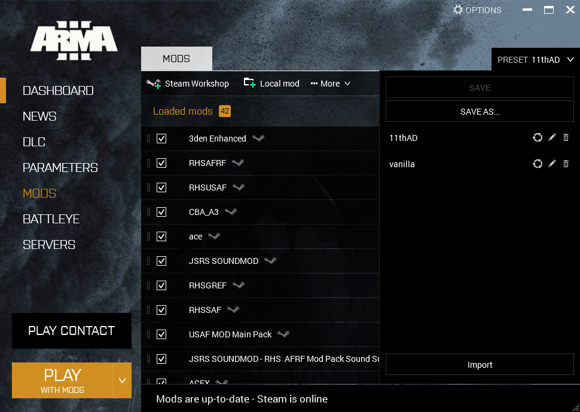
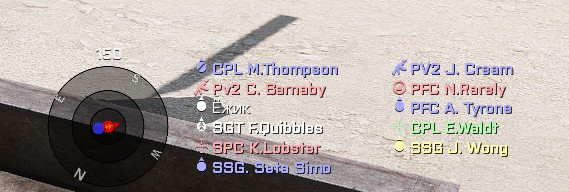
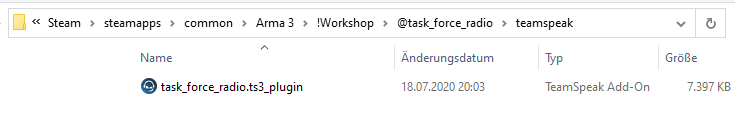
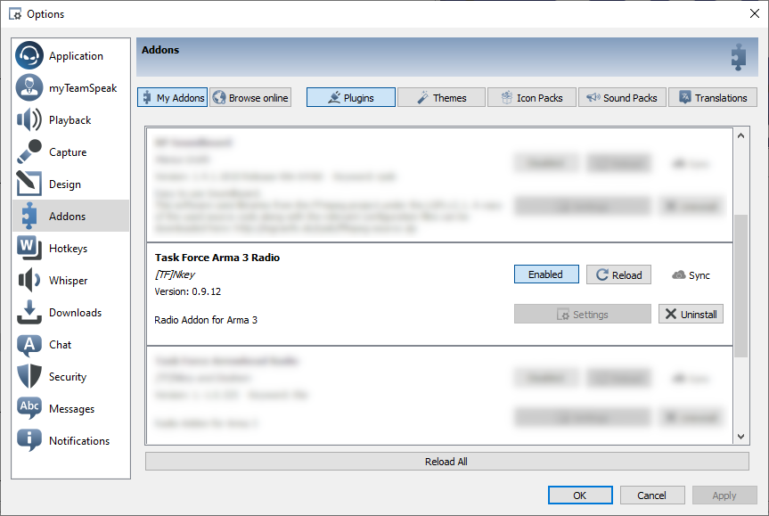
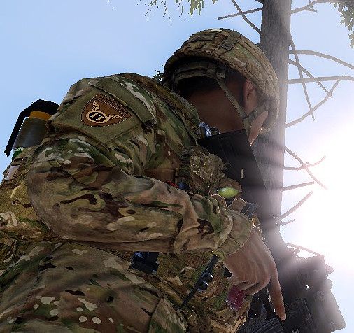
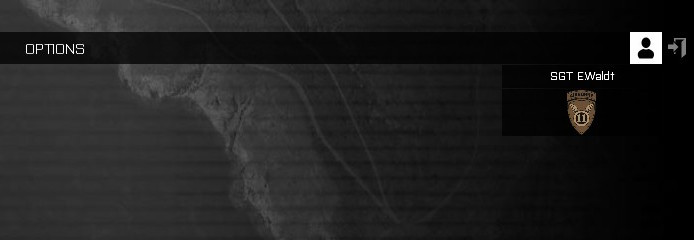

Setup Guide
===========

To play with the 11thAD, you need `Steam <https://store.steampowered.com/>`_, `Arma3 <https://arma3.com/>`_, `Discord <https://discord.com/>`_, and `TeamSpeak3 <https://www.teamspeak3.com/>`_. Both Arma3 and TeamSpeak3 need further modifications. We use around 20 Arma3 mods. One of these mods is `Task Force Radio <http://radio.task-force.ru/en/>`_ (TFAR). This mod models voice and radio comms and creates a connection between Arma3 and TeamSpeak3.

We structure the rest of this guide as follows: First, we explain how to get the Arma3 mods we use. Next, we show how to set up TeamSpeak3 and TFAR. Last, we explain how to get the 11thAD Arma3 arm patch.

Arma3 Mods
----------

This section explains how to get the Arma 3 mods you need to play with the 11thAD.

Download Mod List
^^^^^^^^^^^^^^^^^

On the 11thAD Discord server you find the unit resource channel.

- `Unit Resources channel <https://discord.com/channels/697383135381291039/697390080985399357>`_

Here, you find a link to the current mod list.

The mod list is an HTML file which you can import into your Arma3 launcher. Store the mod list on your computer.

Import Mod List
^^^^^^^^^^^^^^^

Next start the Arma3 launcher. Go to the ``Mods`` section. On the top right you find a button ``Preset``. Clicking it brings up additional options. At the bottom you find a button ``Import``. Clicking it brings up a file-open dialog. Choose the mod list HTML file from the Unit Resources and click ``OK``.

This automatically subscribes and adds all necessary mods including TFAR. Rename and save the imported mod list.

Optional Mods
^^^^^^^^^^^^^

The mod list we provide in the unit resources is minimal. I recommend installing at least ShackTac User Interface:

- `ShackTac User Interface <https://steamcommunity.com/sharedfiles/filedetails/?id=498740884>`_

In-game, ShackTac User Interface gives you a little radar at the bottom center of the screen.

Additionally, I use the following mods for immersion:

- `Enhanced Soundscape <https://steamcommunity.com/sharedfiles/filedetails/?id=825179978>`_
- `JSRS SOUNDMOD <https://steamcommunity.com/sharedfiles/filedetails/?id=861133494>`_
- `JSRS SOUNDMOD - Reloading Sounds <https://steamcommunity.com/sharedfiles/filedetails/?id=1429098683>`_
- `JSRS SOUNDMOD - RHS USAF Mod Pack Sound Support <https://steamcommunity.com/workshop/filedetails/?id=1180533757>`_
- `JSRS SOUNDMOD - RHS AFRF Mod Pack Sound Support <https://steamcommunity.com/sharedfiles/filedetails/?id=945476727>`_
- `JSRS SOUNDMOD - RHS GREF Mod Pack Sound Support <https://steamcommunity.com/sharedfiles/filedetails/?id=1180534892>`_
- `JSRS SOUNDMOD - RHS SAF Mod Pack Support <https://steamcommunity.com/sharedfiles/filedetails/?id=1486541773>`_

TeamSpeak 3 Settings
--------------------

Task Force Radio Addon
^^^^^^^^^^^^^^^^^^^^^^

One of the mods in the 11thAD mod list is ``task_force_radio``. This mod interacts with TeamSpeak3 and does so via a plugin. Find the correct plugin in the mod's installation location. It lives in a directory called ``!Workshop/@task_force_radio`` in the Arma3 installation directory.

The directory has a subdirectory ``teamspeak`` which holds a single file ``task_force_radio.ts3_plugin``. Opening this file with the TeamSpeak3 Package Installer adds the plugin to TeamSpeak3's addon list.

.. caution::
   Both the Task Force Radio website and GitHub page provide download links for different versions TeamSpeak3 TFAR plugin. Do not use these links. They are most likely incompatible with the TFAR mod the Steam Workshop provides.

After restarting TeamSpeak3 open the ``Tools`` menu and select ``Options``. Now navigate to the ``Addons`` page.

Capture
^^^^^^^

Also, visit the ``Capture`` page, select ``Voice Activity Detection``, and set the right voice activity level. Selecting a voice activity level too low will make you `hot mic`, i.e., the microphone will record even when you are not speaking. Selecting a level too high will cut off your words making it hard to understand you.

Also make sure to select ``Echo cancellation`` and ``Echo reduction``. If you play in a quiet environment with a proper headset, you can leave the other options deselected.

Playback
^^^^^^^^

Visit the Playback page and adjust your ``Voice Volume Adjustment`` to +5.0 dB. Also, in-game turn down the master volume, so that you hear your teammates at all times.

11thAD Arm Patch
----------------

Being a member of the 11thAD Arma3 unit is optional. But joining the 11thAD Arma3 unit gives you the 11thAD arm patch many of us use.

- `11thAD on Arma3 Units <https://units.arma3.com/unit/11thad>`_

In the title screen of Arma3 you can select a unit by editing your profile in the top right corner of the screen.

